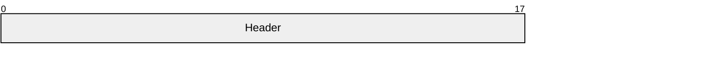
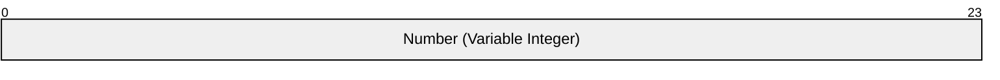
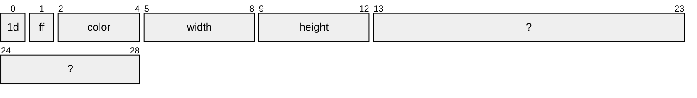
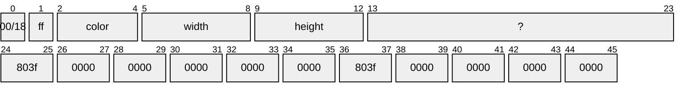
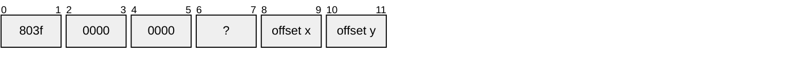
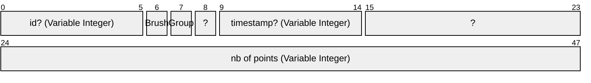
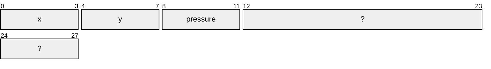

# Header

# Brushes

## Number of brushes

## Brush Structure #1

## Brush Structure #2

# Groups

## Number of groups

## Group Structure

# Figure

## Number of figures

## Figure Structure

## Point Structure

