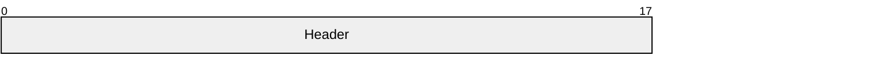
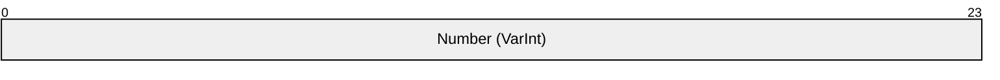
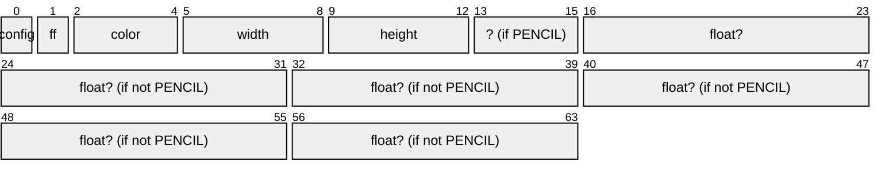
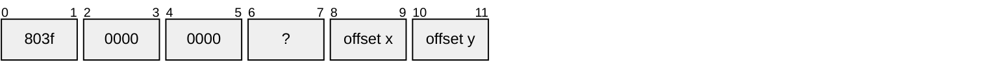
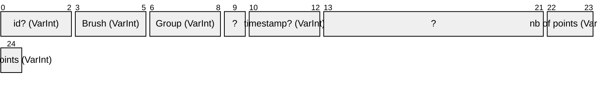
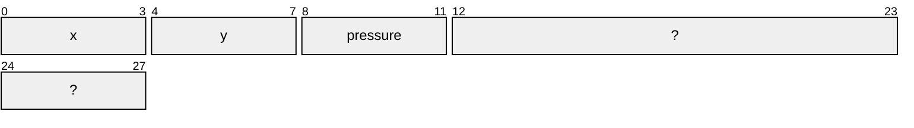

# Header

# Brushes

## Number of brushes

## Brush Types

| Hex.   | Binary     | Type | Number of bytes | Pressure |
| ------ | ---------- | ----------- | --- | ----- |
| `0x00` | `00000000` | Pen         | 46  | True  |
| `0x18` | `00011000` | Pen         | 46  | False |
| `0x02` | `00000010` | Pencil      | 46  | True  |
| `0x1A` | `00011010` | Pencil      | 46  | False |
| `0x05` | `00000101` | Highlighter | 29  | True  |
| `0x1D` | `00011101` | Highlighter | 29  | False |

The three least significant bits determine the type of brush used.

The next two bits indicate whether or not the pressure has been activated.

## Brush Structure

# Groups

## Number of groups

## Group Structure

# Figure

## Number of figures

## Figure Structure

## Point Structure

