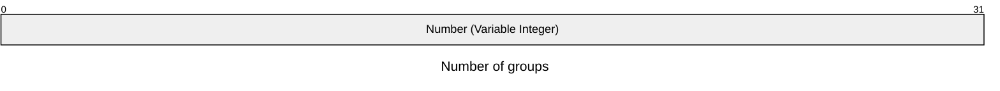
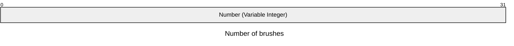
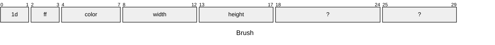
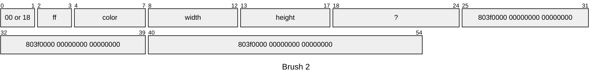

```mermaid
---
title: "Number of groups"
---
packet
0-31: "Number (Variable Integer)"
```

```mermaid
---
title: "Number of brushes"
---
packet
0-31: "Number (Variable Integer)"
```

```mermaid
---
title: "Brush"
---
packet
0-1: "1d"
2-3: "ff"
4-7: "color"
8-12: "width"
13-17: "height"
18-24: "?"
25-29: "?"
```

```mermaid
---
title: "Brush 2"
---
packet
0-1: "00 or 18"
2-3: "ff"
4-7: "color"
8-12: "width"
13-17: "height"
18-24: "?"
25-39: "803f0000 00000000 00000000"
40-54: "803f0000 00000000 00000000"
```

```mermaid
---
title: "Number of groups"
---
packet
0-31: "Number (Variable Integer)"
```